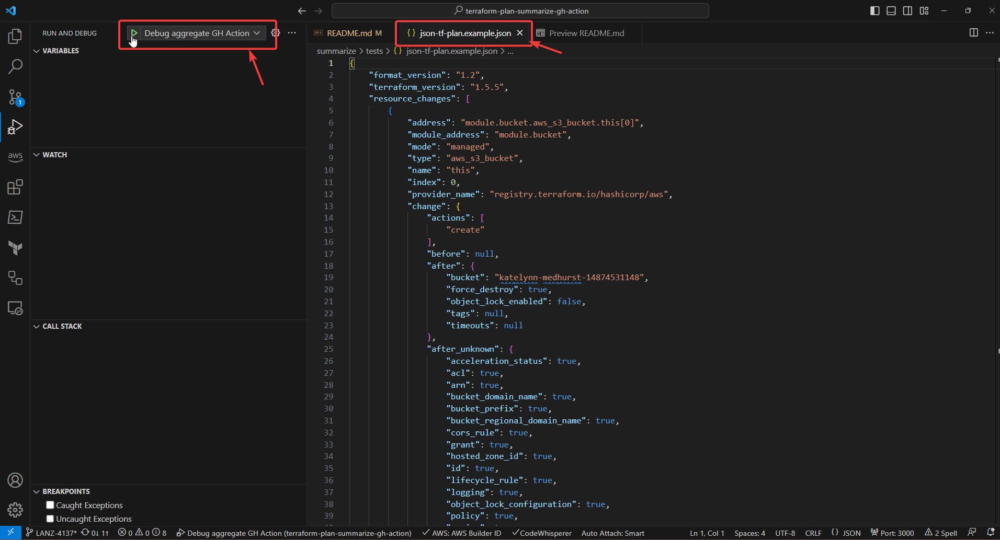
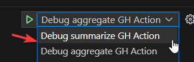

# terraform-plan-summarize-gh-action <!-- omit from toc -->
Repository to store GH Actions related to summarize and aggregate terraform plans

- [code-of-conduct](#code-of-conduct)

## code-of-conduct

Go crazy on the pull requests :) ! The only requirements are:

> - Use _conventional-commits_.
> - Include _jira-tickets_ in your commits.
> - Create/Update the documentation of the use case you are creating, improving or fixing. **[Boy scout](https://biratkirat.medium.com/step-8-the-boy-scout-rule-robert-c-martin-uncle-bob-9ac839778385) rules apply**. That means, for example, if you fix an already existing workflow, please include the necessary documentation to help everybody. The rule of thumb is: _leave the place (just a little bit)better than when you came_.

## github-action

This repository contains the next two GH actions:

### summarize

This action parse a terraform plan and extract its changes and metrics. It also can create artifacts with this information. Next is a JSON artifact example:

```json
{
  "summary": {
    "environment": "ohp-dev",
    "deleted": 0,
    "created": 1,
    "updated": 0,
    "replaced": 0
  },
  "changes": [
    {
      "environment": "ohp-dev",
      "resource": "module.bucket.aws_s3_bucket.this[0]",
      "action": "create",
      "before": {},
      "after": {
        "bucket": "katelynn-medhurst-14874531148",
        "force_destroy": true,
        "object_lock_enabled": false,
        "timeouts": null
      }
    }
  ]
}
```

Please note the `environment` is added from the inputs for aggregate metrics from different terraform plans.

```yaml
name: CI
on:
  pull_request:
    branches: ["main"]
jobs:
  tf-plan-dev:
    runs-on: ubuntu-latest
    steps:
      - uses: actions/checkout@v3
      - name: Create Summary for this step
        uses: ohpensource/terraform-plan-summarize-gh-action/summarize@v0.1.0.0 # update to last version
        with:
          json-terraform-plan-file: dev_tf_plan.json
          environment: 'dev'
          print-summary: true             # Print  the summary in the GH workflow
          attach-markdown-summary: false  # flag for creating a MD file with the resources changed
          attach-csv-summary: false       # flag for creating a CSV file with the resources changed
          attach-json-summary: true       # set this to true if you want to aggregate them

```

### aggregate

It read all the artifacts created by the summarize GH action and aggregate them into one table:

> ⚠️ You have to enable `attach-json-sumamry` in the `summarize` for exporting the terraform plan summary 
> ⚠️ Then, make sure to download them all using the `actions/download-artifact@v3` GH action


```yaml
name: CI
on:
  pull_request:
    branches: ["main"]
jobs:
  tf-plan-dev:
    runs-on: ubuntu-latest
    steps:
      - uses: actions/checkout@v3
      - name: Create Summary for this step
        uses: ohpensource/terraform-plan-summarize-gh-action/summarize@v0.1.0.0 # TODO: update to last version
        with:
          json-terraform-plan-file: dev_tf_plan.json
          environment: 'dev'
          print-summary: true
          attach-markdown-summary: false
          attach-csv-summary: false
          attach-json-summary: true # set this to true if you want to aggregate them

  aggregate:
    runs-on: ubuntu-latest
    needs: ["tf-plan"]
    steps:
      - uses: actions/checkout@v3
      - uses: actions/download-artifact@v3    # Download the tf plan summaries
      - name: Aggregate results
        uses: ohpensource/terraform-plan-summarize-gh-action/aggregate@v0.1.0.0 # TODO: update to last version
        with:
          print-summary: true
          attach-markdown-summary: true
          attach-csv-summary: true
```

### How to run this locally?

A `.vscode/launch.json` has been attached to facilitate debugging using VS Code. 





# summarize test

Test data for summarize GH action:
  * [summarize/tests/json-tf-plan.example.json](summarize/tests/json-tf-plan.example.json): terraform plan in JSON format example.

You can provide your own plan in the [summarize/tests/json-tf-plan.example.json](summarize/tests/json-tf-plan.example.json) but make sure to generate it as next:

```shell
TF_PLAN_PATH="example.tfplan"
TF_PLAN_JSON="example.tfplan.json"
terraform plan -var-file="$YOUR_TF_VAR_PATH" -out="$TF_PLAN_PATH" 
terraform show -json "$TF_PLAN_PATH"  >> "$TF_PLAN_JSON"
```

Then, paste $TF_PLAN_JSON content into [summarize/tests/json-tf-plan.example.json](summarize/tests/json-tf-plan.example.json).

# aggregation test

You can update or extend any of the next files:
  * [aggregate/tests/ohp-dev-summary-json/ohp-dev-summary.json](aggregate/tests/ohp-dev-summary-json/ohp-dev-summary.json)
  * [aggregate/tests/ohp-dev2-summary-json/ohp-dev2-summary.json](aggregate/tests/ohp-dev2-summary-json/ohp-dev2-summary.json)

You can also paste the output of the terraform summarize action.