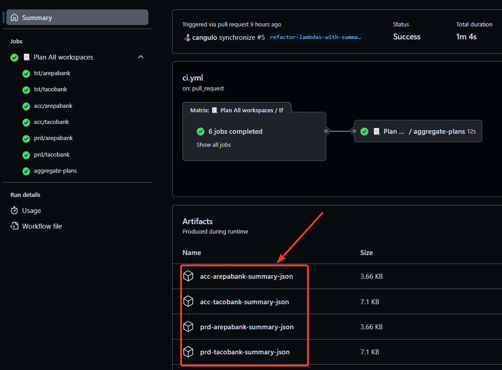
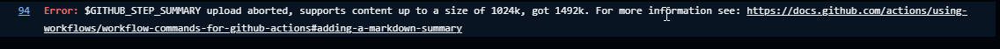
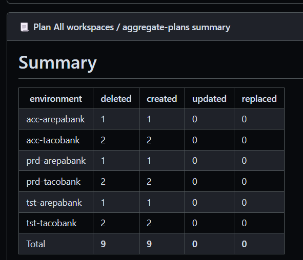
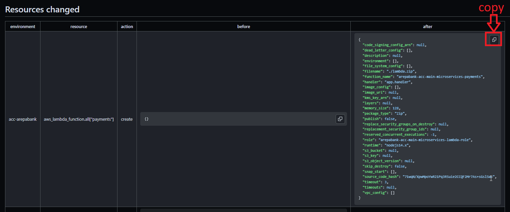

# terraform-plan-summarize-gh-action <!-- omit from toc -->
Repository to store GH Actions related to summarize and aggregate terraform plans

- [code-of-conduct](#code-of-conduct)
- [github-action](#github-action)
  - [summarize](#summarize)
  - [aggregate](#aggregate)
  - [changes that are ignored by the summary](#changes-that-are-ignored-by-the-summary)
  - [How to run this locally?](#how-to-run-this-locally)
    - [summarize test](#summarize-test)
    - [aggregation test](#aggregation-test)


# code-of-conduct

Go crazy on the pull requests :) ! The only requirements are:

> - Use _conventional-commits_.
> - Include _jira-tickets_ in your commits.
> - Create/Update the documentation of the use case you are creating, improving or fixing. **[Boy scout](https://biratkirat.medium.com/step-8-the-boy-scout-rule-robert-c-martin-uncle-bob-9ac839778385) rules apply**. That means, for example, if you fix an already existing workflow, please include the necessary documentation to help everybody. The rule of thumb is: _leave the place (just a little bit)better than when you came_.

# github-action

This repository contains the next two GH actions:

## summarize

This action parse and summarize a terraform plan, print the summary in the [job summary](https://github.blog/2022-05-09-supercharging-github-actions-with-job-summaries/) and export them as artifacts. Next is an example:

```json
{
  "summary": {
    "environment": "ohp-dev",
    "deleted": 0,
    "created": 1,
    "updated": 0,
    "replaced": 0
  },
  "changes": [
    {
      "environment": "ohp-dev",
      "resource": "module.bucket.aws_s3_bucket.this[0]",
      "action": "create",
      "before": {},
      "after": {
        "bucket": "katelynn-medhurst-14874531148",
        "force_destroy": true,
        "object_lock_enabled": false,
        "timeouts": null
      }
    }
  ]
}
```

Please note the `environment` is added from the inputs. It is used for aggregating different terraform plans metrics. 

```yaml
name: CI
on:
  pull_request:
    branches: ["main"]
jobs:
  tf-plan-dev:
    runs-on: ubuntu-latest
    steps:
      - uses: actions/checkout@v3
      - name: tf plan DEV
        run: |
          terraform init -backend-config="dev.tfvars.backend" 
          terraform plan -var-file="dev.tfvars" -out="dev.tfplan"
          # MOST IMPORTANT:
          terraform show  -json "dev.tfplan" >> "dev.tfplan.json"
      - name: Create Summary for this step
        uses: ohpensource/terraform-plan-summarize-gh-action/summarize@v0.1.1 # update to last version
        with:
          json-terraform-plan-file: dev.tfplan.json
          environment: 'dev'              # Used for summaries and artifacts names. DO NOT PROVIDE values with "/"
          print-summary: true             # Print  the summary in the GH workflow
          attach-markdown-summary: true   # flag for creating a MD file with the resources changed
          attach-csv-summary: false       # flag for creating a CSV file with the resources changed
          attach-json-summary: true       # set this to true if you want to aggregate them using the `aggregate` described next

```


Remarks:
* The inputs `attach-*` will create GH artifacts to export the summaries in the format specified. Those artifact are named as the `environment` variable:



* In case you get the next error, enable any of the inputs `attach-*`  so you can get the artifacts and analyze the changes. 
  * Recommendations: Enable `attach-csv-summary` and import the artifact file in Excel, or `attach-markdown-summary` and analyze the markdown in vscode.



* If you are going to aggregate multiple tfplans you can disable `print-summary` and only enable `attach-json-summary` so the aggregate GH action (described next) will get them.

## aggregate

It reads all the artifacts created by the summarize GH action and aggregate them into one table:

> ⚠️ You have to enable `attach-json-summary` in the `summarize` gh action so the tfplan summary is exported  
> ⚠️ Then, make sure to download all using the `actions/download-artifact@v3` GH action


```yaml
name: CI
on:
  pull_request:
    branches: ["main"]
jobs:
  tf-plan-dev:
    runs-on: ubuntu-latest
    steps:
      - uses: actions/checkout@v3
      - name: tf plan DEV
        run: |
          terraform init -backend-config="dev.tfvars.backend" 
          terraform plan -var-file="dev.tfvars" -out="dev.tfplan"
          # MOST IMPORTANT:
          terraform show  -json "dev.tfplan" >> "dev.tfplan.json"
      - name: Create Summary for this step
        uses: ohpensource/terraform-plan-summarize-gh-action/summarize@v0.1.1 # update this to the latest version
        with:
          json-terraform-plan-file: dev.tfplan.json
          environment: 'dev'        # this will be used for the summary first column and artifacts names. DO NOT PROVIDE values with "/"
          print-summary: true
          attach-markdown-summary: false
          attach-csv-summary: false
          attach-json-summary: true # set this to true if you want to aggregate them

  aggregate:
    runs-on: ubuntu-latest
    needs: ["tf-plan"]
    steps:
      - uses: actions/checkout@v3
      - uses: actions/download-artifact@v3    # Download the tf plan summaries
      - name: Aggregate results
        uses: ohpensource/terraform-plan-summarize-gh-action/aggregate@v0.1.1 # update this to the latest version
        with:
          print-summary: true
          attach-markdown-summary: true
          attach-csv-summary: true
```

Example:

tf plans aggregated: 



resources changed details. Please note the last columns is `after`.




Please note you can copy the content in the `before` and `after` column. 

## changes that are ignored by the summary

Changes that only modify resource tags are ignored in the summary.

## How to run this locally?

All GH actions have a `pretest` and `test` script defined in the package.json. First one will empty output artifacts and the second one will run the index.js with the input defined at `tests/.env`.

```json
  "scripts": {
    "pretest": "node scripts/clean-test-files.js",
    "test": "cd tests && node -r dotenv/config ../index.js"
  },
```

⚠️ All the inputs are defined as a environment variable in tests/.env folder

### summarize test

```shell
cd summarize
npm run test
```

Test data for summarize GH action:
  * [summarize/tests/.env](summarize/tests/.env): GH action inputs
  * [summarize/tests/json-tf-plan.example.json](summarize/tests/json-tf-plan.example.json): terraform plan in JSON format example.

You can provide your own plan in the [summarize/tests/json-tf-plan.example.json](summarize/tests/json-tf-plan.example.json) but make sure to generate it as next:

```shell
TF_PLAN_PATH="example.tfplan"
TF_PLAN_JSON="example.tfplan.json"
terraform plan -var-file="$YOUR_TF_VAR_PATH" -out="$TF_PLAN_PATH" 
terraform show -json "$TF_PLAN_PATH"  >> "$TF_PLAN_JSON"
```

Then, paste $TF_PLAN_JSON content into [summarize/tests/json-tf-plan.example.json](summarize/tests/json-tf-plan.example.json).

### aggregation test

```shell
cd aggregate
npm run test
```

You can update or extend any of the next files:
  * [aggregate/tests/.env](aggregate/tests/.env): GH action inputs
  * [aggregate/tests/ohp-dev-summary-json/ohp-dev-summary.json](aggregate/tests/ohp-dev-summary-json/ohp-dev-summary.json)
  * [aggregate/tests/ohp-dev2-summary-json/ohp-dev2-summary.json](aggregate/tests/ohp-dev2-summary-json/ohp-dev2-summary.json)
